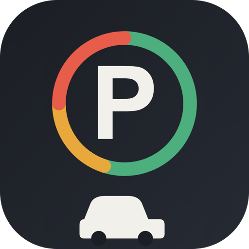
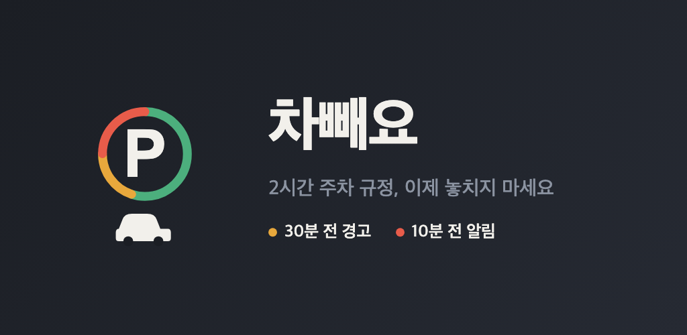
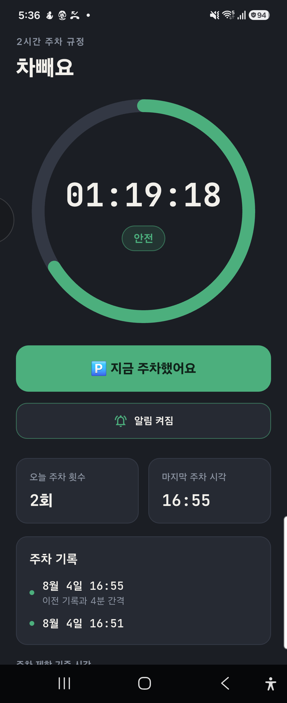
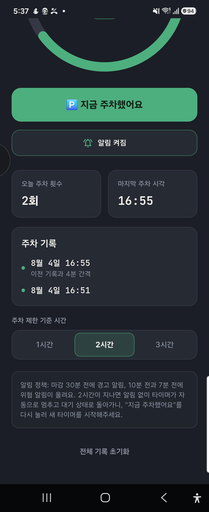

#  **차빼요 — 주차 시간 알림** &nbsp;     

#### 주차 제한 시간이 끝나기 전에 확실하게 알려주는, 버튼 하나짜리 모바일 앱입니다.

#### 기획부터 구현·배포까지 **Claude Code를 활용해 진행한 AI 활용 프로젝트**입니다.

### https://parking-timer-worker.i0364842-757.workers.dev/privacy

---

### 모바일(Android · iOS) / 개인 프로젝트

### 2026.08.01 ~ 진행 중 (Play 스토어 출시 준비)

> **앱 기획·UI 구현·알림 인프라(Firebase + Cloudflare Worker) 구축·스토어 출시 준비 전 과정 단독 진행**

---

### 💻 Overview



<br>
<br>

| **Main** — 남은 시간 · 단계 표시 · 주차 기록 | **Settings** — 제한 시간 선택 · 알림 정책 |
|:---:|:---:|
|  |  |
| 원형 게이지가 남은 시간을 보여주고, 가운데 배지가<br>`안전 → 주의 → 위험 → 초과` 단계를 색으로 알립니다.<br>버튼 하나로 타이머를 시작하고, 오늘 주차 횟수와<br>최근 기록이 아래에 바로 쌓입니다. | 같은 화면을 아래로 내리면 제한 시간을<br>**1 / 2 / 3시간** 중에 탭 한 번으로 바꿀 수 있고,<br>지금 설정에서 알림이 언제 울리는지<br>문장으로 그대로 확인할 수 있습니다. |

<br>

---

### 💡 기획

마트나 카페의 무료 주차 시간을 깜빡해서 과태료를 내는 일이 잦다는 데서 출발했습니다.
비슷한 앱들은 대부분 차량 등록·위치 저장·메모까지 요구하는데, 정작 필요한 건
**"주차했다"는 사실 하나와 제때 오는 알림**뿐이라고 봤습니다. 그래서 회원가입도 설정도
없이 **버튼 한 번으로 끝나는 최소 기능**만 남겼습니다.

개발 과정 전체를 Claude Code와 함께 진행했습니다. 단순 코드 생성이 아니라, 실기기에서
알림이 죽는 원인을 `dumpsys notification`으로 함께 추적하고, 무료 플랜 제약 안에서
서버 구조를 다시 설계하는 등 **문제 진단과 아키텍처 의사결정 단계에서 AI를 활용**했습니다.
아래 '알림이 죽는 문제' 항목이 그 과정에서 나온 결론입니다.

<br>

### 🖇️ 기능

> ### ☝️ One Tap

- 주차한 순간 '주차했어요' 버튼 하나만 누르면 됩니다. 입력할 것도, 로그인도 없습니다.
- 마감 시각이 지나면 알림 없이 타이머가 자동으로 리셋됩니다.

> ### ⏱️ Timer Ring

- 남은 시간을 원형 게이지로 표시하고, 진행 상태에 따라 색이 단계별로 변합니다.
- `안전(초록) → 주의(주황) → 위험(빨강) → 초과(진빨강)` 4단계.

> ### 🔔 Alert

- 마감 **30분 전**(경고) · **10분 전**(위험) · **7분 전**(마지막 경고) 총 3회 알림.
- 위험 알림은 진한 빨간색으로 알림창에 남아, 나중에 봐도 미처리 상태임을 알 수 있습니다.

> ### 🅿️ Limit

- 마트는 2시간, 카페는 1시간처럼 장소마다 다른 제한을 **1 / 2 / 3시간** 중에 탭 한 번으로 변경.
- 어떤 시간을 골라도 '30분 전 · 10분 전'이라는 알림 기준은 동일하게 유지됩니다.

> ### 📊 History

- 오늘 주차 횟수와 최근 기록을 홈 화면에서 바로 확인할 수 있습니다.
- 기록은 기기에만 저장되며 매일 자정에 카운터가 초기화됩니다.

<br>

---

### 🧩 알림이 죽는 문제, 그리고 플랫폼별로 갈라진 구조

이 프로젝트에서 가장 많은 시간을 쓴 부분입니다.

처음에는 양쪽 다 로컬 알림(`flutter_local_notifications` + `AlarmManager`)이었습니다.
그런데 **삼성 등 OEM의 '백그라운드 사용 제한'에 걸리면 예약된 로컬 알람이 조용히
죽었습니다.** 앱은 멀쩡하고 알람만 안 울리니, 사용자는 과태료를 물고 나서야 알게 됩니다.
iOS는 같은 문제가 없어 로컬 알림이 그대로 잘 동작했습니다.

그래서 **안드로이드만 FCM 푸시로 전환**했습니다. FCM `notification` 페이로드는 앱이 아니라
Google Play 서비스가 직접 렌더링하므로 OEM 제한 목록을 우회합니다.

문제는 "예약 시각에" 푸시를 보내려면 서버가 필요한데, Firebase Cloud Functions·Cloud
Scheduler·Firestore TTL이 전부 **유료(Blaze) 플랜**을 요구한다는 점이었습니다. 대신
**Cloudflare Workers Cron Triggers**(무료, 카드 등록 불필요)로 1분마다 Firestore를 폴링해
발송 시각이 지난 알림을 FCM으로 보내는 구조를 택했습니다.

```
                 ┌──────────────── Android ────────────────┐
  [앱] 주차 시작 ─┤ PushService → Firestore                  │
                 │   users/{uid}/scheduledAlerts/{id}       │
                 │        ▲                                 │
                 │        │ 1분마다 cron 폴링                 │
                 │  [Cloudflare Worker] ──→ FCM ──→ [기기]   │
                 └──────────────────────────────────────────┘

                 ┌────────────────── iOS ───────────────────┐
  [앱] 주차 시작 ─┤ NotificationService → 로컬 알림 예약       │
                 └──────────────────────────────────────────┘
```

알림 문구·시점·색은 `lib/models/alert_schedule.dart` **한 곳**에만 두고 양쪽 경로가
공유하도록 해서, 발송 방식이 갈라져도 사용자가 받는 알림은 항상 같게 만들었습니다.

> **수정 시 주의** — 안드로이드 알림 관련 변경은 `lib/services/push_service.dart`(쓰기)와
> `worker/src/index.ts`(발송) **양쪽을 같이** 봐야 합니다. iOS는
> `lib/services/notification_service.dart` 하나면 됩니다.

<br>

### ⏰ 알림 시점을 이렇게 잡은 이유

| 시점 | 종류 | 내용 |
|---|---|---|
| 마감 30분 전 | 경고 (주황) | 슬슬 재주차를 준비하세요 |
| 마감 10분 전 | 위험 (빨강) | 지금 재주차하세요 |
| 마감 7분 전 | 위험 (빨강) | 지금 나가세요 — 마지막 경고 |
| 마감 시점 | 없음 | 알림 없이 타이머만 자동 리셋 |

- **비율이 아니라 고정 오프셋** — 전체의 75% 같은 비율로 잡으면 3시간 주차에서 45분 전에
  경고가 와서 너무 이릅니다. 다급함은 남은 시간의 **절대값**이지 비율이 아닙니다.
- **위험 알림만 두 번** — 매너모드에서는 소리를 쓸 수 없고, 진동 *패턴* 차이(짧게 2번 vs
  길게 3번)는 주머니 속에서 사실상 구분되지 않습니다. 반면 "한 번 울리고 끝" vs
  "잠시 뒤 또 울림"은 확실히 인지됩니다.
- **10분 전과 7분 전, 3분 간격** — 같은 시각에 두 번 보내면 안드로이드가 진행 중인 진동을
  새 진동으로 덮어써서 뭉개진 한 번으로 느껴집니다. 워커 cron이 1분 주기라 최소 1분만
  띄워도 다음 틱으로 갈립니다.
- **마감 시점엔 알림 없음** — "이미 초과했다"는 사후 알림은 사용자가 할 수 있는 게 없어
  의미가 없습니다.
- 제목에 남은 시간을 숫자로 박아둔 것도 의도적입니다. 소리로 긴박함을 전달할 수 없으니
  문구 자체가 남은 시간을 알려주게 했습니다.

> **매너모드에서 알람 소리는 불가능합니다.** 알림 채널에 `USAGE_ALARM`을 지정해도 최신
> 안드로이드가 발송 시점에 `USAGE_NOTIFICATION`으로 되돌려버립니다(실기기
> `dumpsys notification`의 `effectiveNotificationChannel`로 확인). 우회로가 없어
> 진동을 유일한 신호로 두고 설계를 다시 잡았습니다.

<br>

---

### ⚒️ 개발 환경

#### **App**

- Flutter : 3.x (Dart SDK ^3.12.2)
- flutter_local_notifications : 19.4.2 / timezone : 0.10.1
- firebase_core · firebase_messaging · cloud_firestore · firebase_auth
- shared_preferences · permission_handler · vibration · google_fonts · intl

#### **Server**

- Cloudflare Workers (Cron Triggers, 무료 플랜)
- TypeScript : 5.6 / Wrangler : 4.x
- Firebase Firestore · Cloud Messaging(FCM) · 익명 인증

#### **Build**

- JDK 17 (`brew install openjdk@17`)
- Android SDK (`/opt/homebrew/share/android-commandlinetools`)

<br>

### 📁 프로젝트 구조

```
lib/
  main.dart                      앱 진입점 (다크 테마 고정)
  models/
    parking_state.dart           지속 상태 + 단계 경계 상수
    alert_schedule.dart          알림 시점·문구·색 — iOS/Android 공용 단일 출처
  services/
    schedule_service.dart        플랫폼 분기점 (Android→Push, iOS→Local)
    push_service.dart            Android: Firestore에 알림 문서 쓰기, FCM 토큰 관리
    notification_service.dart    iOS: 로컬 알림 예약 / 공용 채널·진동 정의
    storage_service.dart         SharedPreferences JSON 저장
  screens/home_screen.dart       메인 화면 (타이머 링, 기록, 설정)
  widgets/                       timer_ring · stats_row · history_list
  theme/app_theme.dart           색 팔레트 (알림 틴트의 원본)

worker/
  src/index.ts                   cron → Firestore 조회 → FCM 발송 → 만료 문서 정리
  src/privacy.ts                 개인정보처리방침 서빙 HTML

store/                           Play 스토어 출시 자료 (문구·자산·체크리스트)
firestore.rules                  본인 문서만 읽고 쓸 수 있도록 제한
```

<br>

### 🚀 실행

```bash
flutter pub get
flutter run                        # 디버그 실행
flutter analyze
flutter build appbundle --release  # Play 스토어 업로드용
```

```bash
cd worker
npm install
npx wrangler deploy
npx wrangler tail                  # 실시간 로그
curl <worker-url>/__run            # cron 안 기다리고 즉시 1회 실행
```

배포 절차와 문제 해결은 [`worker/README.md`](worker/README.md)를 참고하세요.

<br>

### 🔐 저장소에 없는 파일

클론만으로는 빌드/배포가 되지 않습니다. 아래는 의도적으로 커밋하지 않았습니다.

| 파일 | 용도 | 없으면 |
|---|---|---|
| `worker/secrets/parking-worker-key.json` | GCP 서비스 계정 키 | 워커 배포 불가 |
| `android/app/upload-keystore.jks` | Play 스토어 업로드 키 | **릴리스 서명 불가** |
| `android/key.properties` | 위 키스토어 비밀번호 | 위와 동일 |

> ⚠️ **업로드 키스토어를 잃어버리면 Play 스토어에 업데이트를 영원히 올릴 수 없습니다**(구글도
> 복구 불가). 저장소 밖에 반드시 별도 백업을 두세요. `android/app/build.gradle.kts`는
> `key.properties`가 **없으면 조용히 debug 키로 서명**하므로, 업로드 전에 서명 주체가
> `CN=Chabbaeyo`인지 확인해야 합니다.

`lib/firebase_options.dart`와 `android/app/google-services.json`은 커밋되어 있습니다.
클라이언트에 어차피 내장되는 공개 설정값이고, 실제 접근 통제는 `firestore.rules`가 합니다.

<br>

### 🔏 수집하는 정보

인증은 **Firebase 익명 인증**만 사용합니다. 서버에 올라가는 것은 익명 UID, FCM 토큰,
예약된 알림(시각 + 문구)뿐이며 이름·이메일·위치는 일절 수집하지 않습니다. 알림 문서는
매일 KST 자정에 만료되고 워커가 직접 삭제합니다(Firestore TTL 정책은 유료 플랜 전용).

<br>

### 📦 출시 상태

Play 스토어 **미출시**. 빌드·서명·스토어 자산·문구는 모두 준비되었고 개발자
신원인증 대기 중입니다. 재개할 때는 [`store/listing.md`](store/listing.md)부터 열면
체크리스트·자산 경로·데이터 보안 양식 답변·권한 소명 문구가 복붙 가능한 형태로 정리되어
있습니다.

- 출시 전 **AAB를 다시 빌드할 것** — 스크린샷 캡처 이후 문구를 수정해 디스크의 AAB는 낡았습니다.
- 개인 개발자 계정은 프로덕션 출시 전 **테스터 20명 × 14일 연속 비공개 테스트**가 필요할 수 있습니다.
- 개인정보처리방침은 `store/privacy-policy.md`(원문)와 `worker/src/privacy.ts`(서빙 HTML)에
  **이중으로 존재하니 수정 시 둘 다** 손대야 합니다.
